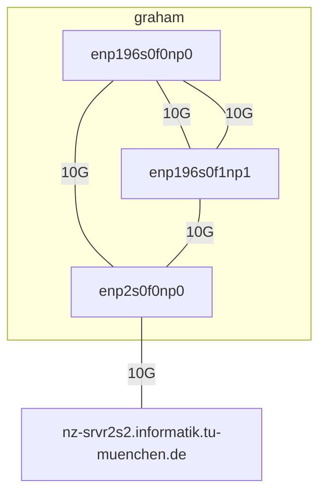

# Some mermaid graph

```mermaid
  graph TD
    graham.enp2s0f0np0["enp2s0f0np0"]-- 10G ---A["nz-srvr2s2.informatik.tu-muenchen.de"]
    graham.enp196s0f0np0["enp196s0f0np0"]-- 10G ---graham.enp2s0f0np0["enp2s0f0np0"]
    graham.enp196s0f0np0["enp196s0f0np0"]-- 10G ---graham.enp196s0f1np1["enp196s0f1np1"]
    graham.enp196s0f1np1["enp196s0f1np1"]-- 10G ---graham.enp2s0f0np0["enp2s0f0np0"]
    graham.enp196s0f1np1["enp196s0f1np1"]-- 10G ---graham.enp196s0f0np0["enp196s0f0np0"]
    subgraph graham
    graham.enp2s0f0np0["enp2s0f0np0"]
    graham.enp196s0f0np0["enp196s0f0np0"]
    graham.enp196s0f0np0["enp196s0f0np0"]
    graham.enp196s0f1np1["enp196s0f1np1"]
    graham.enp196s0f1np1["enp196s0f1np1"]
    end
    click A "https://github.com/ackxolotl/doctor-cluster-config/blob/mermaid/docs/tum/astrid.md" "outside"
```
