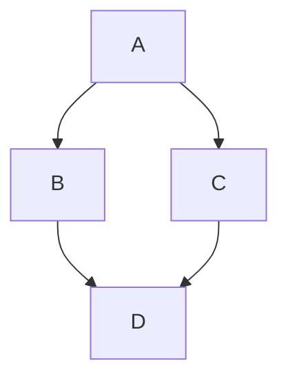
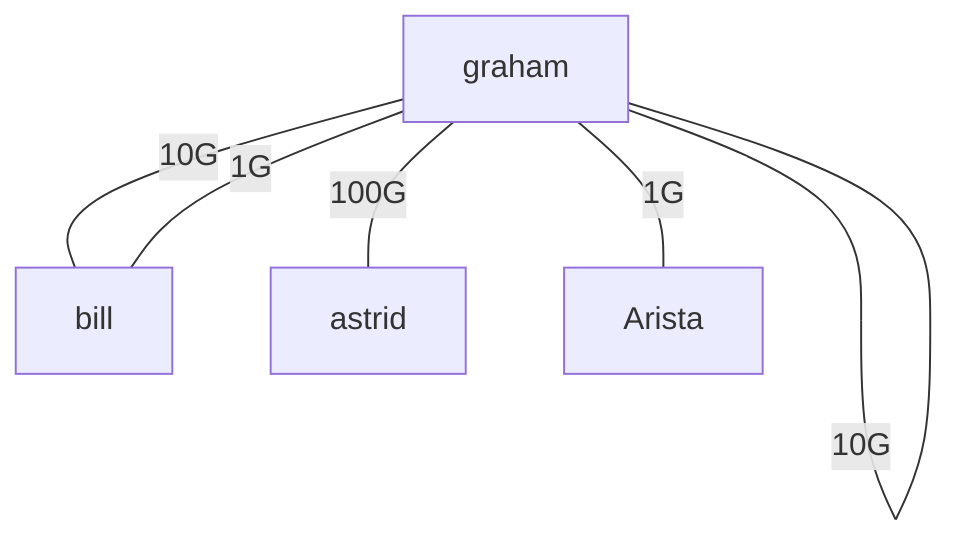
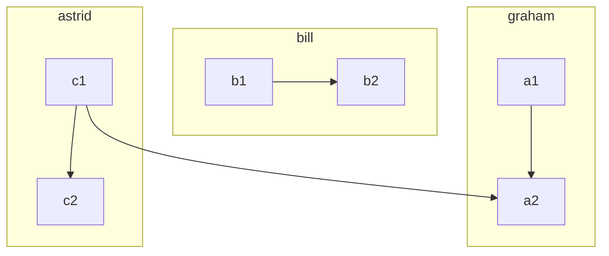
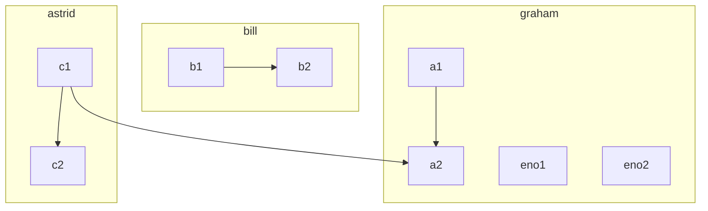

# Some mermaid graph

```mermaid
  graph TD;
      A-->B;
      A-->C;
      B-->D;
      C-->D;
```

Good?

## Graph 2

```mermaid
  graph TD
      graham-- 10G ---graham
      graham-- 10G ---bill
      graham-- 100G ---astrid
      graham-- 1G ---bill
      graham-- 10G ---graham
      graham-- 1G ---Arista
      click astrid "https://github.com/ackxolotl/doctor-cluster-config/blob/mermaid/docs/tum/astrid.md" "astrid"
      click bill "https://github.com/ackxolotl/doctor-cluster-config/blob/mermaid/docs/tum/bill.md" "bill"
```

## Graph 3

```mermaid
  graph TD
    c1-->a2
    subgraph graham
    a1-->a2
    end
    subgraph bill
    b1-->b2
    end
    subgraph astrid
    c1-->c2
    end
```

## Graph 4

```mermaid
  graph TD
    c1-->a2
    subgraph graham
    a1-->a2
    eno1
    eno2
    end
    subgraph bill
    b1-->b2
    end
    subgraph astrid
    c1-->c2
    end
```
